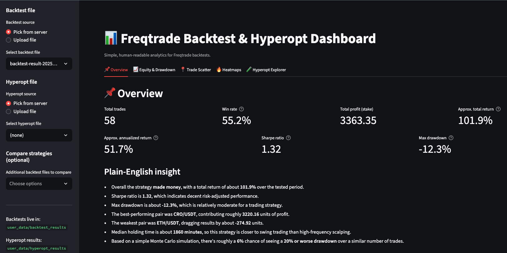
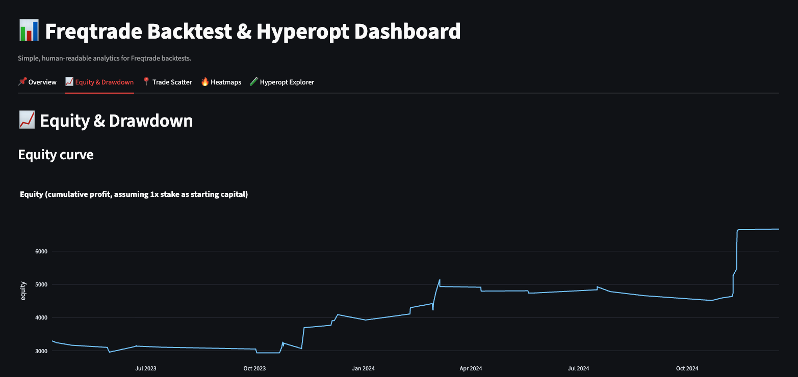

# Freqtrade Trading Strategy & Streamlit Dashboard

This repository showcases an end-to-end quantitative trading workflow built with **Freqtrade** and **Streamlit**.

It includes:
- Custom trading strategies (original + hyperopted)
- Backtesting across multiple datasets / timeranges
- A Streamlit dashboard for analyzing backtest and hyperopt results

---

## Project Structure

trading-strategy-freqtrade/
├─ strategies/ # Trading strategy Python files
├─ streamlit_dashboard/ # Streamlit dashboard app
├─ backtest_results/ # Backtest result PDFs / screenshots
├─ docs/screenshots/ # Dashboard screenshots
├─ requirements.txt
├─ README.md
└─ .gitignore

---

## Trading Strategies

Located in `strategies/`

- **Original strategy**
  - Baseline version before hyperparameter optimization
- **Hyperopted strategy**
  - Optimized parameters using Freqtrade hyperopt

The strategies are designed for **long-only trading** and use:
- Technical indicators (trend, momentum, volatility)
- Market regime filtering
- Risk management via stoploss and ROI rules

---

## Backtesting

Backtests were run using **Freqtrade** on multiple historical datasets, including:
- 2023–2024
- 2023–2025
- 2025

Summary results are saved as **PDFs / screenshots** in:
backtest_results/

> Full raw backtest data is intentionally excluded to keep the repository lightweight and reproducible.

---

## Streamlit Dashboard

The Streamlit app allows interactive analysis of:
- Equity curve and drawdown
- Trade statistics (winrate, profit, duration)
- Pair and time-based heatmaps
- Hyperopt result exploration

### Run the dashboard

```bash
pip install -r requirements.txt
streamlit run streamlit_dashboard/app.py
```

You can either:
Upload backtest / hyperopt files via the sidebar, or

Place them in:
user_data/backtest_results/
user_data/hyperopt_results/

---

## Results & Screenshots

### Streamlit Dashboard


### Equity Curve


### Backtest Summary (2023–2024)
[View backtest report (PDF)](backtest_results/2023_24_backtest.pdf)

Requirements:
Main dependencies (dashboard):
streamlit
pandas
numpy
plotly

Freqtrade installation is handled separately following the official documentation.

Notes:
No API keys or private data are included

Large datasets are intentionally excluded

This repository focuses on strategy design, testing, and analysis, not live trading

Future Improvements:
Walk-forward analysis

Additional risk metrics

Portfolio-level statistics

Live trading integration

Disclaimer:
This project is for research and educational purposes only.
It is not financial advice.
---


